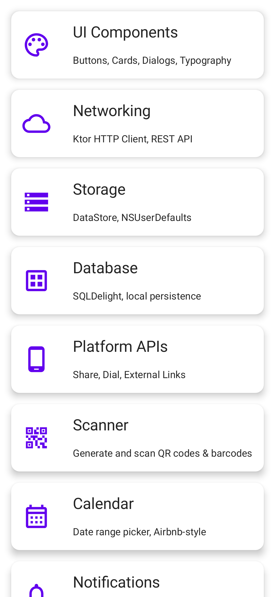
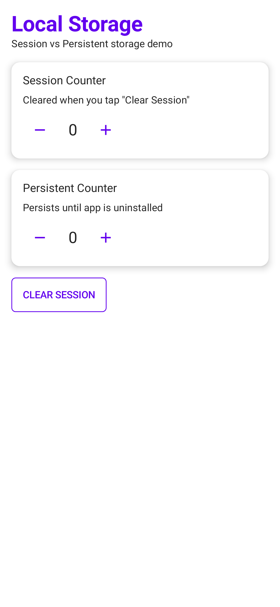
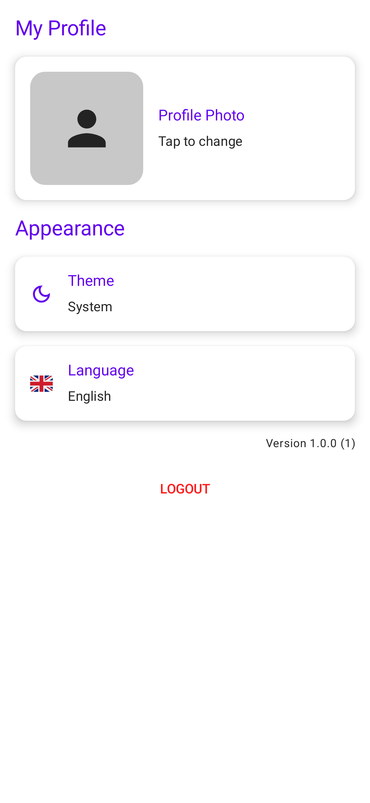

# KMP Showcase

[](https://kotlinlang.org)
[](https://www.jetbrains.com/lp/compose-multiplatform/)


**95% shared code** across Android & iOS

---

<table>
<tr>
<td style="width:50%">

### 🎨 UI & Navigation
- Compose Multiplatform
- Material 3 + Dark Mode
- Navigation3
- 40+ Components

</td>
<td style="width:50%">

### 📱 Platform APIs
- Biometrics (Face ID / Fingerprint)
- Camera & Gallery
- QR/Barcode Scanner
- Location & Permissions

</td>
</tr>
<tr>
<td style="width:50%">

### 🔌 Data & Network
- Ktor 3 HTTP Client
- SQLDelight Database
- DataStore Preferences
- Coil Image Loading

</td>
<td style="width:50%">

### 🔔 Notifications
- Push (FCM / APNs)
- Local Notifications
- Notification Channels
- Permission Handling

</td>
</tr>
</table>

---

## Tech Stack


---


## Screenshots

<table>
<tr>
<td></td>
<td></td>
<td></td>
<td></td>
</tr>
<tr>
<td style="text-align:center">Login</td>
<td style="text-align:center">Home</td>
<td style="text-align:center">Database</td>
<td style="text-align:center">Calendar</td>
</tr>
<tr>
<td></td>
<td></td>
<td></td>
<td></td>
</tr>
<tr>
<td style="text-align:center">Networking</td>
<td style="text-align:center">Storage</td>
<td style="text-align:center">Notifications</td>
<td style="text-align:center">Settings</td>
</tr>
</table>

---

## Architecture

```
Presentation  →  Domain  →  Data
  (UI/VM)       (UseCase)   (Repository)
```

---

## Quick Start

```bash
# Android
./gradlew :androidApp:installDebug

# iOS
open iosApp/iosApp.xcodeproj
```

---

## Project Structure

```
androidApp/     Android app
iosApp/         iOS app (SwiftUI shell)
shared/         Shared KMP module (UI, domain, data)
```

---

## Roadmap

- [ ] Pagination
- [ ] Deep links
- [ ] Maps
- [ ] Video player
- [ ] Offline-first
