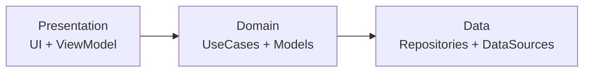

# kmp-showcase — Kotlin Multiplatform Component Showcase

A **KMP portfolio app** demonstrating multiplatform capabilities with **shared business/UI code** and **native shells** for Android and iOS.

## TL;DR

- **Purpose**: Portfolio app showcasing KMP capabilities — each feature is a self-contained demo.
- **KMP shared**: UI (Compose Multiplatform), Navigation3, DI (Koin), networking (Ktor 3), database (SQLDelight), JSON (kotlinx-serialization).
- **Android**: Material 3, Activity Compose, edge‑to‑edge.
- **iOS**: Compose MPP UI hosted in Swift/SwiftUI shell, safe‑area support, Darwin HTTP engine.

---

## Tech Stack

| Category | Technology |
|----------|------------|
| Language | Kotlin |
| UI | Compose Multiplatform |
| Navigation | Navigation3 |
| DI | Koin |
| Networking | Ktor 3 (OkHttp / Darwin) |
| Database | SQLDelight |
| Images | Coil 3 |
| Testing | kotlin.test + Mokkery |
| Code Quality | Detekt + Compose rules |

See `gradle/libs.versions.toml` for versions.

---

## Module Structure

```
root
├─ androidApp/    # Android app (Compose, Material3)
├─ iosApp/        # iOS app (Swift/SwiftUI host)
└─ shared/        # KMP shared code
   └─ src/
      ├─ commonMain/     # Shared (UI, domain, data, DI)
      ├─ commonTest/     # Unit tests
      ├─ androidMain/    # Android implementations
      └─ iosMain/        # iOS implementations
```

---

## Architecture



**MVVM Clean** — Presentation → Domain → Data

---

## Screens

| Screen | Description |
|--------|-------------|
| Home | Feature catalog with cards |
| UI Components | 40+ reusable components (buttons, inputs, dialogs, etc.) |
| Networking | Ktor HTTP client demo |
| Storage | Session vs Persistent storage |
| Database | SQLDelight with notes CRUD, search & sort |
| Platform APIs | Share, dial, links, email, clipboard, location, biometrics |
| Scanner | QR/barcode generator & scanner |
| Settings | Theme & Language settings |

---

## Commands

```bash
# Run tests
./gradlew :shared:testAndroidHostTest

# Run detekt
./gradlew detekt
```

---

## Implemented Features

### Core
- ✅ Compose Multiplatform UI with Material 3
- ✅ Navigation3 with floating nav bar
- ✅ Koin dependency injection
- ✅ Safe area / edge-to-edge
- ✅ Unit tests (kotlin.test + Mokkery)
- ✅ String resources (EN/SK)
- ✅ Global snackbar (themed)

### Networking & Data
- ✅ Ktor HTTP client with JSON
- ✅ DataStore / Preferences
- ✅ SQLDelight local database
- ✅ Coil 3 image loading

### Device Features
- ✅ Camera & Image picker
- ✅ QR/Barcode scanner & generator
- ✅ Biometrics (fingerprint, Face ID)
- ✅ Location / GPS
- ✅ Permissions handling
- ✅ Platform routers (share, dial, links, email, clipboard)

### UI Components
- ✅ Buttons, Cards, Dialogs, Bottom Sheet
- ✅ TextField, Switch, Radio, Checkbox, Chips
- ✅ Slider, Progress indicators, Dividers
- ✅ Segmented Button, Badge, Menu
- ✅ SearchField with debounce
- ✅ Typography, Spacers

### Quality & Build
- ✅ Detekt + Compose rules
- ✅ GitHub Actions CI
- ✅ Crashlytics
- ✅ ProGuard / R8
- ✅ Dark mode & Localization

---

## Roadmap

- [x] Search with debounce
- [ ] Form validation
- [ ] Date/Time pickers
- [ ] Pagination (infinite scroll)
- [ ] Push notifications
- [ ] Deep links
- [ ] Maps integration
- [ ] Video player
- [ ] Offline-first sync

---
